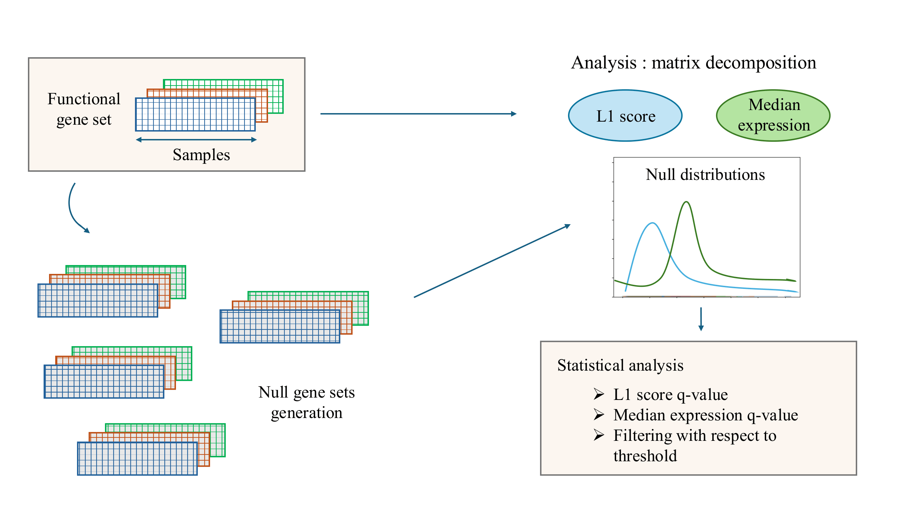

# multiROMA

**Representation and Quantification of Module Activity in multi-omic data**

---



---

## Features

* Compute module activity scores for single-cell and bulk dataset with RNA-seq and proteomic data 
* Seamless integration with AnnData objects (`scanpy`)
* Support for GMT pathway files (e.g., MSigDB hallmark gene sets)

---

## Installation

### Install directly from source

```bash
git clone https://github.com/Lucie-Garance/multiROMA.git
cd pyroma
pip install -e .
```

---

## Quick Start

```python
import roma_gsvd_v2 as Roma

# Initialize ROMA
roma = Roma.ROMA()

# Assign your AnnData object and GMT file
roma.adata = adata  # AnnData from scanpy
roma.gmt   = my_gmt_path

# Compute module activity scores
roma.compute()

# Inspect results
roma.adata.uns['ROMA_active_modules']
```

---

## Tutorials

Comprehensive notebooks are available:

- **Preprocessing dataset**: Data_preprocessing.ipynb
- **MFA method**: MFA_multiROMA.ipynb
- **GSVD method**: GSVD_multiROMA.ipynb

---

## Reproducibility

Companion notebooks and detailed workflows will be available soon. For any detailed information, please contact lucie.garance.barot@gmail.com

---

## References

1. Martignetti L, Calzone L, Bonnet E, Barillot E, Zinovyev A (2016). [ROMA: Representation and Quantification of Module Activity from Target Expression Data](https://doi.org/10.3389/fgene.2016.00018). *Front. Genet.* 7:18.
2. Najm M, Cornet M, Albergante L, et al. (2024). [Representation and quantification of module activity from omics data with rROMA](https://doi.org/10.1038/s41540-024-00331-x). *npj Syst Biol Appl.* 10:8.

